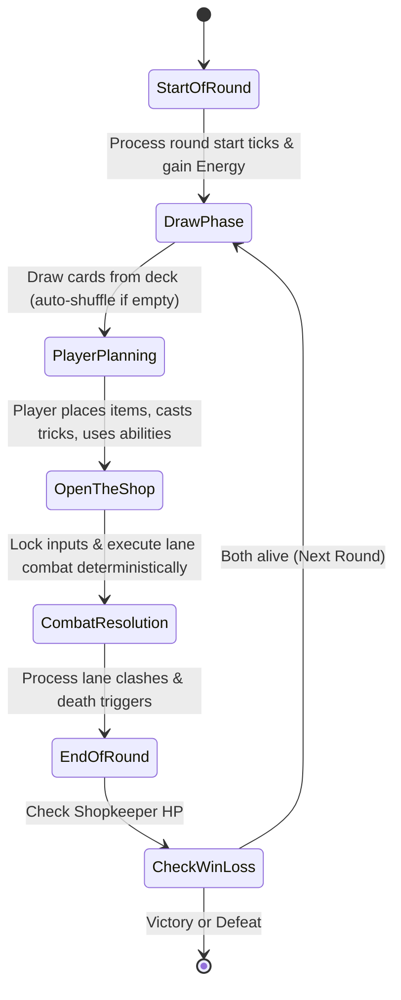

# The Odd Little Shop — Game Design Document & Systems Specification

> **Genre:** Cozy Fantasy Roguelite Deckbuilder / Turn-based 5-Lane Card Battler  
> **Platform Target:** Web Browser (HTML5 / WebGL / Godot 4 Web), zero-cost GitHub Pages hosting, local offline play  
> **Target Session Length:** 15–30 minutes per roguelite run  
> **Audience:** Players who love strategic depth, card synergy, and deckbuilding paired with a relaxing, charming aesthetic.

---

## 1. High-Level Vision & Core Identity

### 1.1 The Central Fantasy
In *The Odd Little Shop*, the player runs a quaint, magical antique and oddities shop where everyday objects possess souls, quirks, and attitudes. A stubborn armchair guards a doorway; an anxious candle sheds comforting light; an irritable toaster sparks when crowded; an old teapot hums reassuring melodies; a lonely sock yearns for its lost partner.

When rival merchants, demanding inspectors, unruly customers, or market disputes threaten the shop, the shopkeeper steps behind the counter and enlists their living merchandise into battle. The shopkeeper supports their living stock with tactical abilities, discounts, and shopkeeping tricks.

### 1.2 The Ten Core Tenets
1. **Never Starved for Cards:** Every round begins with drawing a fresh hand from the active combat deck. If the draw pile empties, the discard pile is shuffled back. The deck is an enduring engine, not a single-use clip of ammo.
2. **Player Plans, Game Resolves:** The player actively manages Energy, plays items into 5 lanes, casts tricks, and activates Shopkeeper abilities during the *Planning Phase*. When the player clicks **OPEN THE SHOP**, combat actions execute automatically and deterministically.
3. **Living Items, Not Generic Stats:** Every unit is an eccentric shop object with personality, distinct sound effects, and behavioral identity.
4. **Distinct 5-Lane Architecture:** Positioning, adjacency, lane blocking, and line-of-sight define tactical choices.
5. **Two Asymmetrical Factions:**
   - **The Cozy Counter:** Warmth, durability, adjacent teamwork, buffing, healing, crafting.
   - **The Midnight Bazaar:** Reclaim, discard, recycling, cursed bargains, tempo risks.
6. **Pure Fair Play (Zero Paywall):** 100% free, no microtransactions, no pay-to-win, no timers, completely self-contained.
7. **Deterministic Resolution Queue:** No hidden RNG or ambiguous timing. Events resolve in clear, observable priority phases.
8. **Permanent Collection vs. Run Deck:** Players unlock cards permanently into their master catalog (120+ cards target), while building run-specific 20-card decks that evolve with roguelite relics and temporary rewards.
9. **Symmetrical AI Engine:** The AI plays by the exact same rules, resources, lane constraints, and draw cycles as the player.
10. **Warm & Cozy Atmosphere:** Zero twitch reflexes, no time limits, charming tactile audio (creaking wood, clinking porcelain, cash register chimes).

---

## 2. Core Gameplay Loop & Turn Structure

### 2.1 Macro Loop (The Roguelite Run)
```
[Select Faction & Shopkeeper] 
       │
       ▼
[Build / Select 20-Card Deck] 
       │
       ▼
[Navigate Branching Map] ──► [Encounter Node: Battle / Elite / Shop / Rest / Event / Boss]
       │                            │
       │                            ▼
       │                    [Card Battle Victory]
       │                            │
       │                            ▼
       │                    [Reward: Choose 1 of 3 Cards / Relic / Coins / Remove Card]
       │                            │
       └────────────────────────────┘
```

### 2.2 Micro Loop (Combat Round Flow)
Every combat round follows a strict, cyclic 6-phase state machine:



#### Detailed Phase Breakdown
1. **Phase 1: Start of Round (`PHASE_ROUND_START`)**
   - Base Energy refreshed: Round 1 = 3 Energy, Round 2 = 4 Energy, Round 3+ = 5 Energy (plus relic/card modifiers).
   - Tick duration on temporary status effects (e.g., Cursed, Guarded, Buff timers).
   - Shopkeeper Momentum / Kassa meter passive increments checked.
2. **Phase 2: Draw Phase (`PHASE_DRAW`)**
   - Both Player and AI draw cards from their respective Draw Piles until reaching standard hand size (default: 4 cards drawn, maximum hand capacity: 7).
   - **Continuous Deck Loop:** If the Draw Pile does not have enough cards, the Discard Pile is immediately shuffled and becomes the new Draw Pile. Hand is replenished seamlessly.
3. **Phase 3: Planning Phase (`PHASE_PLANNING`)**
   - Player has full agency:
     - Drag/drop Item cards onto unoccupied lanes (or valid friendly targets).
     - Target tricks onto friendly/enemy items or lanes.
     - Click Shopkeeper active abilities (paying Energy / consuming charges).
     - Preview anticipated damage and combat paths on the 5 lanes.
4. **Phase 4: Open The Shop (`PHASE_COMMIT`)**
   - Player clicks the **OPEN THE SHOP** bell.
   - User inputs lock. The turn transitions to resolution.
5. **Phase 5: Combat Resolution (`PHASE_RESOLUTION`)**
   - The engine processes the deterministic action queue from Lane 1 through Lane 5.
   - Attacks fire, damage is applied, on-hit and on-death triggers trigger.
6. **Phase 6: End of Round (`PHASE_ROUND_END`)**
   - Items with 0 HP are moved to the Discard Pile (or Exhaust if tagged).
   - Unspent temporary attack buffs expire.
   - Win/Loss Check: If either Shopkeeper reaches 0 HP, combat ends immediately. Otherwise, loop back to Phase 1.

---

## 3. The 5-Lane Battlefield Architecture

```
                  OPPONENT (Shopkeeper HP: 30)
       [ Lane 1 ]  [ Lane 2 ]  [ Lane 3 ]  [ Lane 4 ]  [ Lane 5 ]
          [🤖]        [🐀]        [👺]        [👻]        [👹]
─────────────────────────────────────────────────────────────────
          [🕯️]        [🪑]        [🍞]        [🧸]        [🪞]
       [ Lane 1 ]  [ Lane 2 ]  [ Lane 3 ]  [ Lane 4 ]  [ Lane 5 ]
                   PLAYER (Shopkeeper HP: 30)
                     [Kassa Meter: 3/5]
```

### Lane Combat Rules:
- **Direct Facing:** An item in Lane $X$ attacks the enemy unit occupying opposing Lane $X$.
- **Uncontested Lane (Direct Face Attack):** If an item has no opposing enemy unit in its lane, its attack hits the enemy Shopkeeper directly for its full Attack value.
- **Taunt / Protective Cover:** Certain items (e.g. *Old Armchair*) possess `Taunt`, forcing adjacent or opposing attacks to target them first before hitting other units or the Shopkeeper.
- **Simultaneous Combat Clashes:** When two units face each other, they deal damage simultaneously during that lane's clash step, unless an ability grants `First Strike` or `Swift`.
- **Adjacency:** Lanes $X-1$ and $X+1$ are considered adjacent to Lane $X$. Effects that buff "neighbors" affect units in these adjacent positions.

---

## 4. Deterministic Combat Resolution Pipeline

All combat triggers are queued into a sequential FIFO Event Queue. No random event interleaving occurs.

```
1. PRE-COMBAT TRIGGERS (e.g., "Start of combat, deal 1 damage to opposing lane")
2. LANE-BY-LANE RESOLUTION (Iterate Lane index: 1, 2, 3, 4, 5):
   a. Check if friendly unit exists in lane:
      - If enemy exists: Friendly deals Attack to Enemy, Enemy deals Attack to Friendly.
      - If enemy lane is empty: Friendly deals Attack to Enemy Shopkeeper.
   b. Apply Damage directly to Health pools.
   c. Mark units with Health <= 0 as 'pending_death'.
   d. Execute On-Damage / On-Hit reactive effects immediately.
3. DEATH PROCESSING:
   a. Fire On-Death / Reclaim / Scrap triggers.
   b. Route destroyed Item to owner's Discard Pile (or Exhaust pile).
   c. Clear lane slot.
4. POST-COMBAT TRIGGERS (e.g., "After combat, if you control 3+ items, gain 1 Warmth")
5. WIN/LOSS EVALUATION:
   - If Player Shopkeeper HP <= 0 and Opponent HP <= 0: Draw / Double Defeat.
   - If Opponent HP <= 0: Victory!
   - If Player HP <= 0: Defeat.
```

---

## 5. Deck, Hand, Draw & Card Lifecycle Mechanics

### 5.1 Card Zones
1. **Draw Pile (Face down):** The remaining reserve of the 20-card deck.
2. **Hand (Face up):** Cards available to be played this turn (max hand size 7).
3. **Board (Lanes 1–5):** Active deployed items.
4. **Discard Pile (Face up):** Used tricks and destroyed items. Available for reshuffling or Reclaim.
5. **Exhaust Pile (Out of game):** Cards explicitly removed for the remainder of the current battle.

### 5.2 The Continuous Deck Cycle
```
[ Draw Pile Empty? ] ──Yes──► [ Is Discard Pile Empty? ] ──Yes──► [ Hand remains as-is ]
         │                                 │ No
         No                                ▼
         │                      [ Shuffle Discard Pile ]
         │                                 │
         │                                 ▼
         └──────────────────────► [ Set as new Draw Pile ]
                                           │
                                           ▼
                                    [ Draw Cards ]
```
*Rule Guarantee:* A player will never be soft-locked with 0 cards while cards exist in their discard pile.

---

## 6. The Two Asymmetrical Factions

### 6.1 The Cozy Counter
- **Core Philosophy:** "Care, craftsmanship, hospitality, and home."
- **Faction Keyword — Warmth:** 
  - Units generate `Warmth` counters when healed, buffed, or when adjacent friends survive combat.
  - At thresholds of Warmth (e.g. 5 Warmth), the shop activates *Cozy Radiance* (+1/+1 to all friendly items or Shopkeeper heals 3 HP).
- **Archetypes:**
  1. *Warm Care:* Healing engines and defensive sustain.
  2. *Shop Display:* Strict lane positioning and adjacent neighbor buffs.
  3. *Crafting:* Upgrades that permanently augment items on the board.
  4. *Household:* Swarming cheap common housewares that buff each other.
  5. *Friends:* Symbiotic pairs (e.g., Kettle + Teacup, Left Sock + Right Sock).
  6. *Bargain:* Energy discounts through customer satisfaction.

### 6.2 The Midnight Bazaar
- **Core Philosophy:** "Curiosities, forgotten relics, risky bargains, and second chances."
- **Faction Keyword — Reclaim & Secondhand:**
  - *Reclaim:* Pull specific cards directly out of the Discard Pile back to hand or board.
  - *Recycle:* Discard a card from hand to activate an immediate effect or gain Energy.
  - *Secondhand:* When played from discard, or played a second time in a battle, triggers enhanced stats or effects.
  - *Cursed:* High base stats or very low Energy cost with a tactical downside (e.g. damage to own Shopkeeper, discard a random card).
- **Archetypes:**
  1. *Reclaimed:* Exploiting death and graveyard recursion.
  2. *Cursed Goods:* High-risk, over-statted items that require careful counter-play.
  3. *Black Market:* Energy loaning, cost reduction, and shop price manipulation.
  4. *Sleight of Hand:* Temporary copies and shifting cards between lanes.
  5. *Night Spirits:* Delayed end-of-round triggers and ghost oddities.
  6. *Unstable Oddities:* Strange random triggers with high payoff potential.

---

## 7. The Initial Shopkeepers

### 7.1 The Cozy Counter: 🕯️ Cozy Curator (Barnaby Finch)
- **Role:** Board stabilizer, healer, and buff master.
- **Starting HP:** 30
- **Kassa Meter Capacity:** 5 ticks (Fills by 1 tick each time a friendly unit is healed or receives a buff).
- **Active Ability 1 — "Dust & Polish" (Cost: 1 Energy):**
  - Target a friendly Item: Give it +1 Attack and +1 Health.
- **Active Ability 2 — "Gentle Mending" (Cost: 2 Energy):**
  - Restore 3 Health to any target (friendly item or Barnaby).
- **Signature Ability (Full Kassa Meter — Free to cast): "Grand Showcase":**
  - All friendly items gain +2 Attack, +2 Health, and generate 1 Warmth each. Empty the Kassa meter.

### 7.2 The Midnight Bazaar: 🌙 Midnight Broker (Madame Vespera)
- **Role:** Graveyard recycler, risk tactician, and tempo driver.
- **Starting HP:** 30
- **Kassa Meter Capacity:** 5 ticks (Fills by 1 tick each time a card is discarded or destroyed).
- **Active Ability 1 — "Backroom Swap" (Cost: 1 Energy):**
  - Discard 1 card from hand: Draw 1 card from the Draw Pile.
- **Active Ability 2 — "Secondhand Stitch" (Cost: 2 Energy):**
  - Select 1 random Item from your Discard Pile and put it into your hand with its cost reduced by 1 Energy.
- **Signature Ability (Full Kassa Meter — Free to cast): "Midnight Liquidation":**
  - Return all items destroyed this round back onto random empty lanes with 1 Health and `Temporary`. Empty the Kassa meter.

---

## 8. Card Catalog: Initial 15 Cards — The Cozy Counter

| # | Card Name & Emoji | Cost | Atk | HP | Type | Rarity | Tags | Effect Description | Synergy & Counters | Gameplay Function |
|---|---|---|---|---|---|---|---|---|---|---|
| 1 | 🪑 **Old Armchair** | 3 | 1 | 8 | Item | Common | Furniture, Sturdy | **Taunt** (Opposing enemies must target this unit). When healed, gains +1 Attack. | Synergizes with *Gentle Mending* & *Warm Porridge*. Weak to multi-lane swarm. | Core anchor tank for holding a dangerous lane. |
| 2 | 🕯️ **Timid Candle** | 1 | 1 | 3 | Item | Common | Light, Fragile | **Adjacent Support:** Adjacent friendly items gain +1 Attack. | Pairs with *Old Armchair* and *Stuffed Teddy*. Countered by direct lane snipers. | Cheap early aura buffer to accelerate damage. |
| 3 | 🧸 **Stuffed Teddy** | 2 | 2 | 4 | Item | Common | Toy, Loyal | When an adjacent ally takes damage, Teddy gains +1 Attack. | Protects *Timid Candle*, combos with high-HP tanks. Vulnerable to direct burst. | Scaling bruiser that grows stronger from skirmishes. |
| 4 | 🍞 **Grumpy Toaster** | 2 | 3 | 2 | Item | Common | Appliance, Fiery | **Start of Round:** If this unit has full HP, deal 1 damage to the opposing lane enemy. | Great lane pressure against 1-HP tokens. Vulnerable to fast retaliation. | Offensive tempo card that punishes empty/weak enemy lanes. |
| 5 | 🪞 **Jealous Mirror** | 3 | 0 | 5 | Item | Uncommon | Glass, Curious | Copies the Attack stat of the highest-Attack friendly neighbor at start of combat. | Scales enormously next to buffed *Teddy* or *Armchair*. Useless in isolated lane. | Flexible payoff card rewarding concentrated buffs. |
| 6 | 🧦 **Lonely Left Sock** | 1 | 1 | 2 | Item | Common | Fabric, Oddity | If you control *Right Sock*, both gain +2 Attack and +2 Health. | Direct tribal pair with *Right Sock*. Low impact if drawn alone. | Cheap cooperative combo piece. |
| 7 | 🧦 **Right Sock Found**| 1 | 2 | 1 | Item | Common | Fabric, Oddity | **On Play:** Draw 1 card if you control *Left Sock*. | Cycles your deck, accelerates board presence. Vulnerable to AoE. | Cantrip and combo activator for the Household archetype. |
| 8 | 🫖 **Singing Teapot** | 2 | 1 | 4 | Item | Uncommon | Kitchen, Melodic | **End of Round:** Restore 2 Health to the most damaged friendly item. | Powers up *Old Armchair* and generates Kassa ticks for Barnaby. Slow clock. | Engine card for sustain and Warmth generation. |
| 9 | 🥣 **Warm Porridge** | 1 | - | - | Trick | Common | Food, Care | Restore 4 Health to target item or Shopkeeper. Gain 1 Warmth. | Triggers heal-reactive passives. Doesn't develop board presence on its own. | Efficient emergency healing and meter boost. |
| 10 | 🪵 **Hand-Carved Polish** | 2 | - | - | Upgrade | Uncommon | Craft, Wood | Attach to an Item. Target gains +2/+3 and "Cannot be moved or knocked back." | Makes *Old Armchair* virtually unkillable. High investment vulnerable to transform/discard. | Single-target stat multiplier for the Crafting archetype. |
| 11 | 🧹 **Brisk Broom** | 2 | 2 | 2 | Item | Common | Household, Agile | **Swift:** Attacks before the opposing enemy during resolution. | Snipes low-HP aggressive units before they deal damage. Low base stats. | Lane control against glass-cannon enemies. |
| 12 | 🪴 **Sunlit Fern** | 2 | 0 | 6 | Item | Rare | Plant, Cozy | At the start of your round, gain +1 Energy this round. | Accelerates expensive items early. Vulnerable to early aggressive lanes. | Ramp engine enabling high-cost late-game drops. |
| 13 | 🏷️ **Bargain Sticker** | 1 | - | - | Trick | Rare | Economy, Paper | Reduce the Energy cost of the next 2 cards in your hand by 1. | Allows explosive multi-card combo turns. Net -1 card in hand. | Combo enabler and tempo burst. |
| 14 | 🕰️ **Grandfather Clock**| 4 | 2 | 7 | Item | Epic | Furniture, Ancient | **End of Round:** All friendly items in odd lanes gain +1 Attack; even lanes gain +1 Health. | Giant board-wide scaling engine. Requires wide board presence. | Late-game build-around finisher for Shop Display. |
| 15 | 👑 **The Masterpiece Tapestry** | 5 | 3 | 10 | Item | Legendary | Relic, Cozy | Friendly items cannot have their stats reduced. At 5 Warmth, deals 4 damage to all enemy lanes. | Ultimate win condition against debuff/curse decks. High 5-Energy cost. | Faction pinnacle card rewarding complete board mastery. |

---

## 9. Card Catalog: Initial 15 Cards — The Midnight Bazaar

| # | Card Name & Emoji | Cost | Atk | HP | Type | Rarity | Tags | Effect Description | Synergy & Counters | Gameplay Function |
|---|---|---|---|---|---|---|---|---|---|---|
| 1 | 🗝️ **Rust-Eaten Key** | 1 | 1 | 2 | Item | Common | Metal, Junk | **On Death:** Draw 1 card and add 1 Kassa tick to your Shopkeeper. | Perfect discard/sacrifice fodder. Weak on board stats. | Deck thinner and resource accelerator. |
| 2 | 🏺 **Cracked Urn** | 2 | 2 | 3 | Item | Common | Ceramic, Mystery | **On Death:** Deal 2 damage to the opposing lane and 1 damage to your own Shopkeeper. | Great trading efficiency. Self-damage can be risky at low HP. | Aggressive tempo card that trades up easily. |
| 3 | 🕯️ **Sputtering Night-Light** | 1 | 2 | 1 | Item | Common | Light, Unstable | **Secondhand:** If played from discard or played a second time, gains +2/+2. | Amazing with *Madame Vespera*'s reclaim ability. Fragile on first play. | Core engine unit for the Reclaim archetype. |
| 4 | 🗡️ **Cursed Dagger** | 1 | 4 | 1 | Item | Common | Weapon, Cursed | **Cursed:** When played, discard a random card from your hand. | Massive early attack for 1 energy. Hand penalty can discard key cards. | Fast aggressive lane pressure. |
| 5 | 📦 **Unmarked Crate** | 3 | 1 | 5 | Item | Uncommon | Container, Mystery | **On Death:** Summon a random 2-cost Item from your faction onto this lane. | Replaces itself upon death. Vulnerable to non-lethal lane locks. | Board presence sticky defender. |
| 6 | 🪆 **Nesting Doll of Shadows** | 2 | 2 | 2 | Item | Rare | Toy, Occult | **On Death:** Summon a 1/1 *Shadow Doll* with **Swift** in this lane. | Extends lane defense across multiple clashes. | Two-stage blocker that stalls opponent advances. |
| 7 | 🌘 **Midnight Salvage** | 1 | - | - | Trick | Common | Magic, Recycle | Discard 1 card from hand. Gain 2 Energy this round. | Converts dead cards into immediate explosive plays. Reduces card advantage. | High-tempo resource generator for Black Market decks. |
| 8 | 🪙 **Counterfeit Doubloon**| 0 | - | - | Trick | Common | Currency, Junk | Gain 1 Energy. At the end of the round, take 1 damage. | Zero-cost ramp. Stacks self-damage if overused. | Free tempo boost to chain cheap combos. |
| 9 | 🪞 **Distorted Looking-Glass**| 2 | 1 | 4 | Item | Uncommon | Glass, Cursed | Swaps Attack values with the opposing enemy unit when combat begins. | Neutralizes massive enemy bosses while turning itself into a deadly threat. | Tactical counter to giant single targets. |
| 10 | 📜 **Contract of Ruin** | 2 | - | - | Trick | Rare | Cursed, Paper | Destroy target friendly item. Deal its Attack + Health as damage to opposing lane. | Massive burst finisher using tall buffed units or high-HP containers. | Sacrifice removal and face-damage reach. |
| 11 | 🐀 **Scrap Rat** | 1 | 1 | 1 | Item | Common | Beast, Scavenger | **Scavenge:** Whenever another unit dies anywhere, Scrap Rat gains +1 Attack. | Grows exponentially during bloody multi-lane clashes. Dies to any 1-damage ping. | Scaling threat that punishes attrition trades. |
| 12 | 🎭 **Borrowed Face** | 2 | 0 | 4 | Item | Uncommon | Oddity, Disguise | Copies all abilities and keywords of the opposing enemy unit. | Adapts to enemy powerhouses. Weak if placed against weak utility cards. | Dynamic counter-pick card rewarding smart lane positioning. |
| 13 | 🔮 **Whispering Orb** | 3 | 1 | 5 | Item | Rare | Occult, Relic | **End of Round:** If your hand is empty, draw 2 cards and deal 2 damage to all enemies. | Inverts hand disadvantage into massive advantage for fast empty-hand decks. | Hand-dump build-around archetype anchor. |
| 14 | 🕰️ **Pawned Pocketwatch** | 2 | 2 | 3 | Item | Epic | Gear, Temporal | **Reclaim:** Return 1 Trick from your discard pile to your hand. It costs 0 this turn. | Re-plays key tricks like *Midnight Salvage* or *Contract of Ruin*. | Infinite trick recursion engine. |
| 15 | 🖤 **The Black Market Stall** | 5 | 4 | 8 | Item | Legendary | Market, Cursed | **Start of Round:** Return a random item destroyed last round to your hand. Its cost is 0. | Endless value generation. Expensive initial investment. | Late-game attrition powerhouse that overwhelms through free units. |

---

## 10. Initial Encounters: Enemies & Bosses

### 10.1 Standard & Elite Enemies
1. **The Rowdy Imp (Tier 1 Encounter):**
   - *HP:* 18 | *Deck:* Fast 1-cost vermin (*Dust Mites*, *Scrappy Kittens*).
   - *Behavior:* Fills lanes 1–3 rapidly with 1/2 and 2/1 units.
2. **The Fussy Collector (Tier 1 Encounter):**
   - *HP:* 22 | *Deck:* Armor and preservation (*Reinforced Vitrines*, *Velvet Cushions*).
   - *Behavior:* Buffs high-health units and attempts to win by board stall.
3. **The Unscrupulous Liquidator (Elite Encounter):**
   - *HP:* 32 | *Passive:* "Repossession" — When a player unit dies, the Liquidator gains 1 Armor.
   - *Behavior:* Runs high-attack sacrifice combos and direct-damage tricks.

### 10.2 Signature Act Bosses
1. **Boss 1: The Property Inspector (Mr. Grimshaw)**
   - *HP:* 45 | *Special Mechanic — "Code Violation":*
     - At the start of every 2nd round, the Inspector locks down 1 player lane with "Condemned Tape". No cards can be placed in that lane for 1 round.
   - *Counter-Play:* The player must distribute units across multiple lanes and use lane-mobility or tricks to bypass the blocked lane.
2. **Boss 2: The Endless Customer**
   - *HP:* 55 | *Special Mechanic — "Browsing Swarm":*
     - Every round, summons two 1/3 *Indecisive Shoppers* in random empty lanes.
     - When an *Indecisive Shopper* dies, it heals the Endless Customer for 2 HP unless killed by an adjacent attack.
   - *Counter-Play:* Requires strong burst damage or simultaneous AoE sweeps rather than slow trickle trades.
3. **Boss 3: The Store Cleaner (Madame Sterilis)**
   - *HP:* 65 | *Special Mechanic — "Harsh Chemical Sweep":*
     - Every 3rd round, all buffs (Attack and Health increases) are removed from all units on the board.
   - *Counter-Play:* Forces players to focus on raw base stats, deathrattles, or burst trick rounds rather than infinite scaling buffs.
4. **Boss 4: The Night Watchman**
   - *HP:* 75 | *Special Mechanic — "Lantern Patrol":*
     - Shakes the lanes: At the end of each round, all units shift 1 lane to the right (Lane 5 wraps to Lane 1).
   - *Counter-Play:* Rewards adaptive lane positioning and flexible symmetrical layouts.

---

## 11. Roguelite Run Progression & Meta Systems

### 11.1 The Branching Map
- **Map Structure:** 3 Acts, 12–15 depth levels per Act with 2–3 branching paths.
- **Node Types:**
  - ⚔️ **Battle:** Standard combat encounter against thematic creatures/customers.
  - 💀 **Elite:** Hard battle with increased gold, guaranteed Rare+ card reward, and a Relic choice.
  - 🏪 **Curio Merchant (Shop):** Purchase cards, remove cards from deck, buy relics, or buy shopkeeper repair/healing.
  - ☕ **Rest Stop (The Hearth):** Choose between *Rest* (Recover 30% Shopkeeper Max HP) or *Tune-Up* (Upgrade an existing card in your deck with +1/+1 or reduced cost).
  - 📜 **Mysterious Event:** Narrative decision with trade-offs (e.g. "A strange peddler offers an unknown locked chest for 20 coins or 5 Shopkeeper HP").
  - 👑 **Act Boss:** Climax battle with unique lane-altering mechanics.

### 11.2 Initial Relics
1. **Old Shop Bell:** The first Item card played each battle costs 1 less Energy.
2. **Endless Receipt:** Whenever you discard a card, gain 1 Kassa tick on your Shopkeeper.
3. **Lucky Jade Plant:** At the end of every combat victory, restore 3 Shopkeeper HP.
4. **Bottomless Teapot:** The first time an item is healed each round, draw 1 card.
5. **Rusty Scale:** Whenever you take damage to your Shopkeeper, draw 1 card (max once per round).

---

## 12. AI Architecture (Symmetrical & Scalable)

The AI operates under the identical ruleset as the human player:
- **Draw & Cycling:** AI manages a Draw Pile, Hand, Discard Pile, and Deck Reshuffle.
- **Energy Budget:** AI receives standard round Energy (3 -> 4 -> 5).
- **Decision Engine (Heuristic Evaluator):**
  1. *Threat Analysis:* Calculate incoming damage on each of the 5 lanes.
  2. *Blocking Score:* Identify lethal threats and calculate optimal blocker placements.
  3. *Synergy Scoring:* Evaluates adjacent bonuses (e.g., placing *Timid Candle* between two units).
  4. *Difficulty Profiles:*
     - **Casual / Easy:** Evaluates plays with a 25% random noise factor, occasionally leaves open lanes.
     - **Standard / Normal:** Plays on-curve, prioritizes blocking incoming fatal attacks, uses Shopkeeper abilities whenever affordable.
     - **Master / Hard:** Calculates multi-lane trades, preserves combo pieces for high-yield turns, and targets player weakness.

---

## 13. Data-Driven Architecture & Save System

### 13.1 Card Data Schema (JSON / Resource Model)
```json
{
  "id": "cozy_armchair_01",
  "name": "Old Armchair",
  "faction": "cozy_counter",
  "type": "item",
  "rarity": "common",
  "energy_cost": 3,
  "base_attack": 1,
  "base_health": 8,
  "tags": ["furniture", "sturdy"],
  "keywords": ["taunt"],
  "effects": [
    {
      "trigger": "on_healed",
      "action": "buff_stat",
      "target": "self",
      "stat": "attack",
      "value": 1
    }
  ],
  "flavor_text": "He was already standing here before the shop opened its doors.",
  "art_asset": "res://art/cards/cozy_armchair.png"
}
```

### 13.2 Save System Schema (`save_v1.json`)
Saves are strictly local (`localStorage` in browser, `user://` in desktop Godot), versioned, and crash-resilient:
```json
{
  "version": 1,
  "timestamp": 1727280000,
  "meta_progression": {
    "unlocked_cards": ["cozy_armchair_01", "cozy_candle_02", "midnight_key_01"],
    "unlocked_shopkeepers": ["barnaby_finch", "madame_vespera"],
    "completed_runs": 0,
    "shop_expansion_level": 1
  },
  "active_run": {
    "is_active": true,
    "faction": "cozy_counter",
    "shopkeeper_id": "barnaby_finch",
    "shopkeeper_current_hp": 26,
    "shopkeeper_max_hp": 30,
    "relics": ["old_shop_bell"],
    "coins": 45,
    "current_deck": ["cozy_armchair_01", "cozy_candle_02", "..."],
    "map": {
      "current_act": 1,
      "current_node_id": "act1_node_3",
      "visited_nodes": ["act1_node_1", "act1_node_2"]
    },
    "in_battle_state": {
      "is_in_battle": false
    }
  }
}
```

---

## 14. Audio, UI & Visual Design Directives

### 14.1 Visual Tone: "Cozy Weird Fantasy"
- Hand-drawn storybook warmth with chunky silhouettes and expressive living objects.
- **The Cozy Counter Palette:** Warm cream (`#FBF8EE`), Honey Oak (`#8B5A2B`), Sage Green (`#87A96B`), Amber Glow (`#FFBF00`).
- **The Midnight Bazaar Palette:** Deep Midnight Violet (`#1C162E`), Moonlight Indigo (`#2C3E50`), Aged Brass/Gold (`#D4AF37`), Eerie Mint (`#50C878`).

### 14.2 Soundscape & Haptics
- **Action SFX:** Tactile, organic acoustic sounds:
  - Card Draw: Crisp parchment sliding over polished cedar.
  - Card Placed: Satisfying wooden thud or porcelain clink.
  - Open The Shop Button: Bright, resonant brass counter bell (**"TING!"**).
  - Combat Clash: Soft impacts, fabric whooshes, muffled metallic clangs.
- **Music:** Calming acoustic guitar, warm upright piano, gentle celesta, lo-fi fantasy background hum. No stressful battle alarms.
