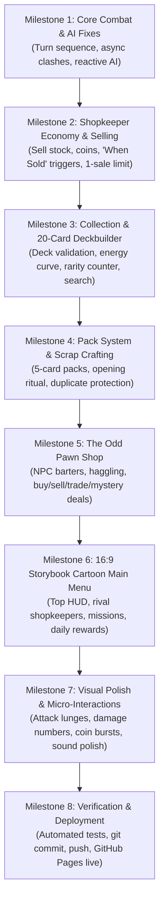

# Overhaul Roadmap & Milestones: The Odd Little Shop

> **Execution Philosophy:** Incremental delivery, verified after each milestone, maintaining strict project isolation and zero-cost web deployment.

---

## 🗺️ Milestone Overview

---

## 📌 Milestone Deliverables & Acceptance Criteria

### Milestone 1: Core Combat & Responsive AI Engine
- **Goal:** Fix the AI freeze/inactivity and transform instantaneous resolution into clear, visual lane-by-lane clashes.
- **Tasks:**
  - Refactor `CombatEngine` to use asynchronous step-by-step resolution (`resolveLanesSequentially()`).
  - Introduce explicit `AI_PLANNING` phase where AI calculates lane threats, plays cards with a human-like delay, and triggers abilities.
  - Implement dynamic damage numbers and visual clash indicators.
- **Verification:** AI actively deploys units, protects lanes, casts tricks, and trades blows every round.

### Milestone 2: Selling & Pawn Economy
- **Goal:** Embody the shopkeeper fantasy where items can be sold for tactical Coins.
- **Tasks:**
  - Add `sellUnit(isPlayer, laneIndex)` to `CombatEngine` (max 1 sale per round limit).
  - Calculate explicit Sale Values based on cost, rarity, and buffs.
  - Implement "When Sold" trigger effects on cards (e.g. *Antique Lamp* grants extra coin, *Fragile China* buffs neighbors, *Loyal Footstool* heals).
  - Add "SOLD!" visual burst and coin counter increment.
  - Grant AI the heuristic ability to sell crippled units to finance big tempo drops.
- **Verification:** Player and AI can sell items, collect coins, trigger sold abilities, and respect the 1-sale/turn limit.

### Milestone 3: 20-Card Deckbuilder & Collection Screen
- **Goal:** Provide a deep strategic pre-battle deckbuilder with exact 20-card constraints.
- **Tasks:**
  - Build two-panel Deckbuilder UI: Left = 20-Card Deck with Energy Curve histogram and Rarity breakdown; Right = Master Collection with faction, rarity, type, and keyword filters.
  - Enforce deck legality: exactly 20 cards, max 2 copies per card.
  - Save custom deck configurations to local storage.
- **Verification:** Decks are strictly validated, saved, and loaded into battle.

### Milestone 4: Collectible Card Packs & Scrap Crafting
- **Goal:** Satisfying card collection progression without real-world money.
- **Tasks:**
  - Create pack generator: 5 cards per pack with rarity probabilities (Common, Uncommon, Rare, Epic, Legendary).
  - Dedicated interactive Pack Opening Screen: Click to rip pack, 5 cards face down, flip cards one by one with rarity chime and glows.
  - Duplicates beyond 2 automatically convert into **Scrap**, usable to craft missing cards.
- **Verification:** Earn packs from battle victories, open packs with animations, and craft cards with Scrap.

### Milestone 5: The Odd Pawn Shop Encounters
- **Goal:** Barter, trade, and haggle with quirky NPC visitors.
- **Tasks:**
  - Create `src/data/pawnShop.js` with NPC personalities (*The Collector*, *The Traveler*, *The Hedge Witch*, *The Student*, *The Bargain Hunter*).
  - Offer mechanics: Buy rare oddity, Sell matching inventory, Trade card for card, Mystery deal, and turn-based Haggling.
  - Pawn shop offers target cards missing from the player's collection.
- **Verification:** Pawn shop encounters trigger between battles or from menu, handling trades and haggling successfully.

### Milestone 6: 16:9 Storybook Cartoon Main Menu & Global HUD
- **Goal:** Replace the prototype UI with a warm, colorful, professional cartoon game hub.
- **Tasks:**
  - 16:9 responsive layout with dark turquoise cartoon landscape, floating clouds, and particles.
  - Top HUD: Avatar, Level, Coins, Gems, Settings, Mail.
  - Left: 2 stacked Mission cards (*Cozy Quest*, *Midnight Deal*) with progress bars and rewards.
  - Center: Dominant **BATTLE** panel featuring rival shopkeepers (*Barnaby Finch* vs *Madame Vespera*), cartoon energy sparkles, and rank progress bar.
  - Right: Daily Reward card (Day 1–7), Event/News card, Streak tracker.
  - Bottom: Navigation bar for Collection, Deckbuilder, Packs, Shop, and Friends ("Coming Soon").
- **Verification:** Every menu button opens a fully functional screen; zero fake interactions.

### Milestone 7: Visual Juice, Animations & Audio Polish
- **Goal:** Visceral, satisfying tactical feel across all interactions.
- **Tasks:**
  - Card hover tilts (8–12px lift, 3D perspective, dynamic shadow).
  - Attack lunge animations and lane clash impact shakes.
  - Floating combat text (`-X` damage, `+X` heal, `SOLD!`).
  - Web Audio soundscape improvements: crisp card snaps, coin clinks, and brass counter bell resonance.

### Milestone 8: Full Verification, Documentation & GitHub Deployment
- **Goal:** Test suite pass, updated docs, and live GitHub Pages release.
- **Tasks:**
  - Expand `test/testEngine.html` covering Selling, AI turns, Deck constraints, and Pack generation.
  - Update all documentation files in `docs/`.
  - Push commit to `https://github.com/DiPiDyl/the-odd-little-shop.git`.
  - Confirm live build on GitHub Pages.
